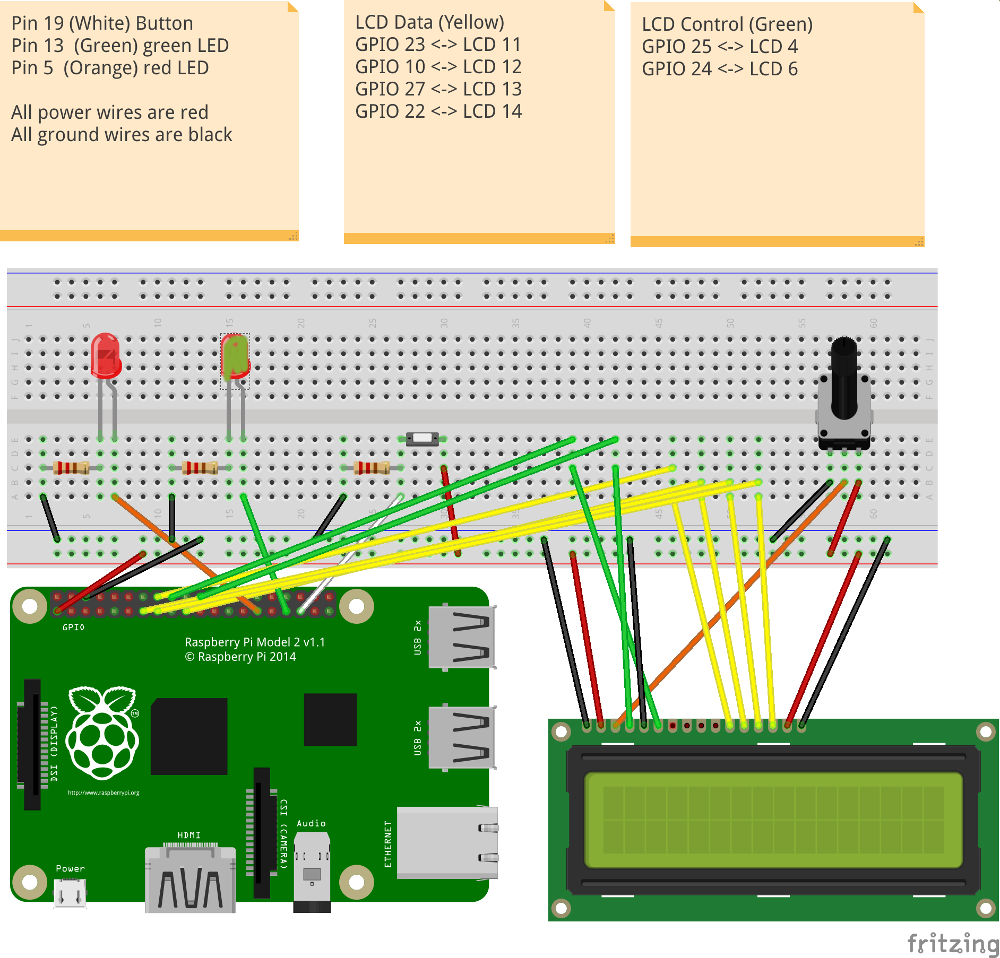

# Mastermind

Links:

- You can use any machine with an installation of the `gcc` C compiler for running the C code of the game logic
- Template for the C program: [master-mind.c](master-mind.c)
- Template for the ARM Assembler program: [mm-matches.s](mm-matches.s)

## Building and running the application

You can build the main C program (in `master-mind.c`), and the `testm.c` testing function, by typing

> make all

and run the Master Mind program in debug mode by typing

> make run

and do unit testing on the matching function

> make unit

or alternatively check C vs Assembler version of the matching function

> make test

A test script is available to do unit-testing of the matching function. Run it like this from the command line

> sh ./test.sh


## Unit testing

This is an example of doing unit-testing on 2 sequences (C part only):

```
> ./cw2 -u 121 313
0 exact matches
1 approximate matches
```

The general format for the command line is as follows (see template code in `master-mind.c` for processing command line options):

```
./cw2 [-v] [-d] [-s] <secret sequence> [-u <sequence1> <sequence2>]
```

## Wiring

An **green LED**, as output device, should be connected to the RPi2 using **GPIO pin 13.**

A **red LED**, as output device, should be connected to the RPi2 using **GPIO pin 5.**

A **Button**, as input device, should be connected to the RPi2 using **GPIO pin 19.**

An **LCD display**, with a potentiometer to control contrast, should be wired to the
Raspberry by as shown in the Fritzing diagram below.

You will need resistors to control the current to the LED and from the Button. You
will also need a potentiometer to control the contrast of the LCD display.

The Fritzing diagram below visualises this wiring.


